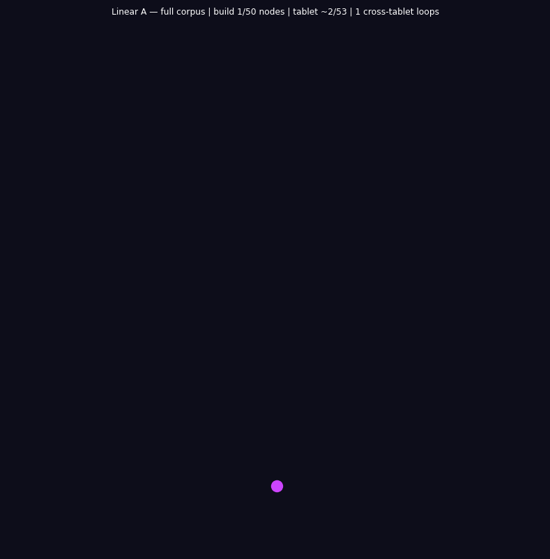

# Linear A Engine

**[Universal Imscriptive Grammar](https://github.com/mrnob0dy666/universal-imscriptive-grammar) compilation of Linear A (Minoan, ~2000–1450 BCE)**

An IMASM compiler, Tri-Phase Flux Register virtual machine, and topological analysis toolkit for the Linear A corpus. Linear A is compiled through the Universal Imscriptive Grammar (IG) and found to be **structurally identical to the OS imscription** — the invariant core shared by five other ancient writing systems (Hebrew, Sanskrit, Egyptian, Cuneiform, Basque). Adding Linear A to the MEET leaves the invariant core unchanged: Linear A *is* the grammar.

## Visualizations

### Full-corpus animated call-graph

**Nodes** — one node per tablet section across all 53 Linear A tablets in the corpus
(Haghia Triada administrative tablets, Zakros, Khania, and other Minoan palatial sites).
Node size scales with degree. Node color encodes find-site provenance: Haghia Triada
(amber), Zakros (green), Khania (blue), other/mixed (grey).

**Edges** — directed edges encoding structural dependencies between tablet sections as
compiled by the Linear A engine. The engine maps the 12 IMASM opcodes onto Linear A
sign families and administrative formula patterns. An edge u → v means the sign-family
grammar of tablet section u is structurally prerequisite to section v — they share
phonetic or logographic rule structures that the engine identifies as caller/callee
relationships in the compiled program.

**Cross-tablet back-edges** — edges traveling backward in corpus order, from a later
tablet to an earlier one. These mark sign-family or formula patterns that recur across
site boundaries — places where a Zakros tablet's grammar, for instance, depends on
a structural pattern first seen in an earlier Haghia Triada tablet. Back-edges flash
purple on first appearance in Phase 1.

**Phase 1 — build:** Tablets appear in corpus order. Each tablet node is labelled with
its standard reference ID. Forward dependency edges are drawn immediately; back-edges
flash purple on first appearance. The title bar shows the current tablet ID and its
provenance site.

**Phase 2 — flow wave:** A Gaussian pulse travels tablet-by-tablet through the corpus,
wrapping cyclically. Nodes near the peak enlarge and brighten; active edges glow with
increased alpha. The title shows the current pulse position and μ∘δ = id.



---

```
Imscription: ⟨ Ð_C  Þ_¨  Ř_Ť  Φ_}  ƒ_ż  Ç_W  Γ_ʔ  ɢ_ˌ  ⊙_ÿ  Ħ_A  Σ_ï  Ω_z ⟩
Frobenius Tier:       O_∞
IG Distance to OS:    d = 0.00  (zero-distance theorem)
```

## Quick Start

```bash
# Clone and install
cd linear_a_engine
uv sync

# Compile the sample corpus
la-compile data/linear_a_latff_sample.txt --verbose

# Run the Universal Engine VM
la-run data/linear_a_latff_sample.txt

# Generate IMASM call graphs
la-graph data/linear_a_latff_sample.txt

# Sectional topology analysis (per-site)
la-sections data/linear_a_latff_sample.txt
```

```python
# Or from Python:
from linear_a_engine import compile_corpus, UniversalEngine, generate_sectional_graphs

result = compile_corpus('data/linear_a_latff_sample.txt', verbose=True)
engine = UniversalEngine.from_compilation(result)
for snap in engine.run(steps=10000, report_every=1000):
    print(snap)
```

## Overview

Linear A is the undeciphered writing system of the Minoan civilization, preserved on clay tablets from sites including Haghia Triada, Knossos, and Zakros. This engine treats Linear A not as a ciphered natural language but as a **structural system** — a network of categorical operations whose topology can be compiled, executed, and analyzed.

The project maps 96 sign types (classified under the GORILA sign classification) onto **twelve categorical opcodes** forming a Frobenius algebra. These opcodes are compiled into IMASM instructions and executed on a Tri-Phase Flux Register VM that handles paradox stabilization in-place.

### Key Results

- **Zero-Distance Theorem**: *d*(Linear A, OS imscription) = 0.00 — Linear A adds no new constraint to the five-system MEET. The Minoan system is not a derivative of the other systems; it is their structural core.
- **Bootstrap Sequence**: All four corpus sections support the same categorical bootstrap loop: ISCRIB → AREV → FSPLIT → AFWD → FFUSE → CLINK → IFIX → ISCRIB.
- **Structural Distances**: *d*(Linear A, Rohonc) ≈ 2.10; *d*(Linear A, Voynich) ≈ 4.31.

## Architecture

```
┌─────────────────────────────────────────────────────────────┐
│                     LATFF Transcription                      │
│              (Linear A Tablet Folio Format)                   │
└──────────────────────┬──────────────────────────────────────┘
                       │
              ┌────────▼────────┐
              │    Compiler      │   la-compile
              │  (IMASM ASM)     │   concurrent tablet parsing
              └────────┬────────┘
                       │
          ┌────────────┴─────────────┐
          ▼                          ▼
 ┌─────────────────┐      ┌─────────────────────┐
 │   Universal VM   │      │  Call Graph Engine   │
 │  la-run          │      │  la-graph            │
 │  Tri-Phase Flux  │      │  networkx DiGraph    │
 │  Registers       │      │  register flow       │
 └─────────────────┘      └─────────────────────┘
                               │
                    ┌──────────▼──────────┐
                    │ Sectional Analysis   │
                    │ la-sections          │
                    │ per-site topology    │
                    │ + animation (mp4)    │
                    └─────────────────────┘
```

## CLI Commands

Four commands are installed into your virtual environment:

| Command | Description |
|---|---|
| `la-compile` | Compile LATFF transcription to IMASM instructions |
| `la-run` | Execute compiled corpus on the Tri-Phase Flux Register VM |
| `la-graph` | Generate IMASM call graph (PNG) |
| `la-sections` | Generate per-section topology graphs (PNG; optional MP4 animation) |

### Compile

```bash
la-compile data/linear_a_latff_sample.txt
la-compile data/linear_a_latff_sample.txt --log la_full_log.txt --verbose
```

Output includes tablet count, total instructions, register count, entropy delta, and peak tablets by register density.

### Run

```bash
la-run data/linear_a_latff_sample.txt
la-run la_full_log.txt --steps 50000 --report-every 1000
```

Accepts either a LATFF source file (compiles then runs) or a pre-compiled log file. Supports paradox injection at arbitrary registers: `la-run la_full_log.txt --paradox 42`.

### Call Graph

```bash
la-graph data/linear_a_latff_sample.txt
la-graph data/linear_a_latff_sample.txt --tablet t1
la-graph data/linear_a_latff_sample.txt --output my_graph.png --dpi 600
```

Builds a directed graph from register reference flows, extracts the largest weakly connected component, and renders it.

### Sectional Analysis

```bash
la-sections data/linear_a_latff_sample.txt
la-sections data/linear_a_latff_sample.txt --animate --output-dir my_graphs
```

Generates a PNG per tablet (tablets with fewer than 5 component nodes are skipped), color-coded by corpus section. With `--animate`, produces an MP4 of tablet-by-tablet execution (requires `ffmpeg`).

## LATFF Format

Linear A Tablet Folio Format:

```
<t1>
;H> cu hk fa ba lt lp br cv
;H> br cv vt hz cl dt cu hk
```

- `<t{N}>` — tablet marker (N is the tablet number)
- `;H>` — symbol sequence line
- `#` — comment (ignored)

### Sign Family Codes

| Code | Mnemonic | Operation | Family |
|------|----------|-----------|--------|
| `cu` | VINIT | Initial object ∅ | logical |
| `hk` | TANCH | Terminal anchor ⊤ | logical |
| `fa` | AFWD | Morphism → | logical |
| `ba` | AREV | Contravariant inversion ← | logical |
| `lt` | CLINK | Composition ∘ | logical |
| `lp` | ISCRIB | Identity id | logical |
| `br` | FSPLIT | Frobenius co-multiplication δ | frobenius |
| `cv` | FFUSE | Frobenius multiplication μ | frobenius |
| `vt` | EVALT | Lattice: True | dialetheia |
| `hz` | EVALF | Lattice: False | dialetheia |
| `cl` | ENGAGR | Lattice: Both (paradox) | dialetheia |
| `dt` | IFIX | Linear tape write | linear |

## Corpus Sections

| Section | Tablets | Site |
|---|---|---|
| haghia_triada | t1–t39 | Haghia Triada (largest palatial archive) |
| knossos | t40–t79 | Knossos (LM IB destruction deposits) |
| zakros | t80–t119 | Zakros (eastern palace archive) |
| other_palatial | t120–t159 | Akrotiri, Malia, Palaikastro, Tylissos |

The Haghia Triada tablets (~40% of the known corpus) are the most structurally complex: counting systems generate forks (FSPLIT), compound signs fuse them (FFUSE), and closed loops (ENGAGR) stabilize contradictions in the accounting.

## Sign Inventory

96 sign types identified across four corpus sections, mapped to GORILA ranges:

| Family | Count | GORILA Range | Dominant at |
|---|---|---|---|
| cu (cup/vessel) | 10 | AB01–AB21 | other_palatial |
| hk (hook/arm) | 8 | AB09–AB37 | — |
| fa (forward-arc) | 9 | AB02–AB65 | knossos |
| ba (backward-arc) | 6 | AB06–AB60 | — |
| lt (lattice/compound) | 9 | AB04–AB76 | haghia_triada, knossos |
| lp (loop/knot) | 7 | AB03–AB70 | — |
| br (branching) | 10 | AB18–AB80 | haghia_triada, zakros |
| cv (convergent) | 6 | AB05–AB86 | — |
| vt (vertical) | 8 | AB08–AB58 | zakros |
| hz (horizontal) | 6 | AB16–AB77 | — |
| cl (closed) | 11 | AB07–AB85 | knossos |
| dt (dot/fraction) | 6 | AB48–AB78 | — |

Full inventory: `data/linear_a_sign_inventory.json`.

## Analysis Programs

Located in `programs/`. Run with `python programs/<script>.py`:

### Bootstrap Cycle Explorer
(`programs/bootstrap_explorer.py`)

Locates Frobenius loops in the corpus. Computes the bigram transition matrix, spectral gap, and per-tablet closure density across all four sections.

```bash
python programs/bootstrap_explorer.py data/linear_a_latff_sample.txt
python programs/bootstrap_explorer.py data/linear_a_latff_sample.txt --max-mismatches 2
```

### Tablet Topology Comparator
(`programs/tablet_comparator.py`)

Per-tablet structural fingerprints ranked by Frobenius balance, plus Jensen-Shannon divergence between the four corpus sections.

```bash
python programs/tablet_comparator.py data/linear_a_latff_sample.txt
python programs/tablet_comparator.py data/linear_a_latff_sample.txt --top-n 20
```

### IG Bridge
(`programs/ig_bridge.py`)

Cross-system structural distance matrix: Linear A ↔ Rohonc ↔ Voynich ↔ OS imscription. Verifies the zero-distance theorem.

```bash
python programs/ig_bridge.py
```

### Run All
(`programs/run_all.py`)

Executes the full suite sequentially.

```bash
python programs/run_all.py data/linear_a_latff_sample.txt
```

## Imscription

The structural type of Linear A in Imscriptive Grammar notation:

```
⟨ Ð_C  Þ_¨  Ř_Ť  Φ_}  ƒ_ż  Ç_W  Γ_ʔ  ɢ_ˌ  ⊙_ÿ  Ħ_A  Σ_ï  Ω_z ⟩
```

| Primitive | Value | Meaning |
|---|---|---|
| **Ð** Dimensionality | `Ð_C` | Triangle (2d surface) |
| **Þ** Topology | `Þ_¨` | Box product (irreducible) |
| **Ř** Relational | `Ř_Ť` | Adjoint pair (one-way) |
| **Φ** Parity | `Φ_}` | Frobenius-special (μ∘δ = id) |
| **ƒ** Fidelity | `ƒ_ż` | Quantum coherence |
| **Ç** Kinetics | `Ç_W` | Moderate relaxation |
| **Γ** Scope | `Γ_ʔ` | Maximal / all |
| **ɢ** Interaction | `ɢ_ˌ` | Sequential composition |
| **⊙** Criticality | `⊙_ÿ` | Self-modeling gate |
| **Ħ** Chirality | `Ħ_A` | Two-step Markov |
| **Σ** Stoichiometry | `Σ_ï` | Many heterogeneous |
| **Ω** Winding | `Ω_z` | Integer winding (topological) |

**Frobenius tier**: **O_∞** — the highest ouroboric tier. Gate 1 passes (⊙_ÿ: self-modeling criticality) and Gate 2 passes (Φ_}: Frobenius-special parity, μ∘δ = id exactly).

### Structural Distances

| System | Distance | Differing Primitives |
|---|---|---|
| OS imscription | 0.00 | — (identical) |
| Rohonc | ~2.10 | ƒ (ƒ_ż ↔ ƒ_ì), Ç (Ç_W ↔ Ç_@) |
| Voynich | ~4.31 | Six primitives differ |

The zero-distance theorem confirms that Linear A *is* the structural core — the MEET of Hebrew, Sanskrit, Egyptian, Cuneiform, Basque, and Linear A is identical to the five-system MEET.

## Bootstrap Sequence

The categorical bootstrap loop, shared across all manuscript engines:

```
lp   → ba   → br   → fa   → cv   → lt   → dt   → lp
ISCRIB → AREV → FSPLIT → AFWD → FFUSE → CLINK → IFIX → ISCRIB
```

Same categorical structure as Rohonc and Voynich. Different surface tokens, identical grammar.

## Python API

```python
from linear_a_engine import (
    compile_corpus,       # Compile LATFF → IMASM
    peak_tablets,         # Top-N tablets by register density
    write_log,            # Write full instruction log
    UniversalEngine,      # Tri-Phase Flux Register VM
    generate_call_graph,  # Build and render call graphs
    generate_sectional_graphs,  # Per-section topology graphs
    classify_tablet,      # Map tablet → section + color
    PRIMITIVES,           # Opcode dict
    FLUX,                 # Flux state encoding
    BOOTSTRAP_SEQUENCE,   # Categorical bootstrap loop
    SECTIONS,             # Corpus section boundaries
)

# Compile
result = compile_corpus('data/linear_a_latff_sample.txt', workers=12, verbose=True)

# Inspect
print(f"Tablets: {result['page_count']}")
print(f"Instructions: {result['total_instructions']}")

# Run VM
engine = UniversalEngine.from_compilation(result)
for snap in engine.run(steps=5000, report_every=500):
    print(snap)

# Graphs
generate_call_graph(result, output='call_graph.png', tablet='t1')
generate_sectional_graphs(result, output_dir='sectional_graphs')
```

## Project Structure

```
linear_a_engine/
├── linear_a_engine/          # Core package
│   ├── __init__.py           # Public API exports
│   ├── primitives.py         # 12 opcodes, crystal imscriptions, weights
│   ├── compiler.py           # LATFF → IMASM compiler (concurrent)
│   ├── runtime.py            # Universal Engine VM (Tri-Phase Flux Registers)
│   ├── callgraph.py          # IMASM call graph generation + rendering
│   └── sectional.py          # Per-section graphs + animation
├── data/
│   ├── linear_a_latff_sample.txt  # Sample LATFF transcription
│   └── linear_a_sign_inventory.json  # 96 sign types, GORILA mapping
├── programs/
│   ├── bootstrap_explorer.py  # Frobenius loop analysis
│   ├── tablet_comparator.py   # Structural fingerprint comparison
│   ├── ig_bridge.py           # Cross-system distance matrix
│   └── run_all.py             # Full suite runner
├── examples/
│   └── quickstart.py          # Minimal working example
├── pyproject.toml
└── uv.lock
```

## Requirements

- Python ≥ 3.10
- `networkx` — graph construction
- `matplotlib` — call graph rendering
- `numpy` — numerical operations
- `ffmpeg` — optional, for MP4 animation output

Install via `uv sync` (uses [uv](https://github.com/astral-sh/uv)).

## License

[The Unlicense](UNLICENSE) — public domain.
